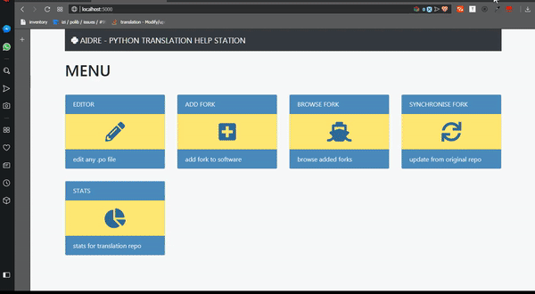
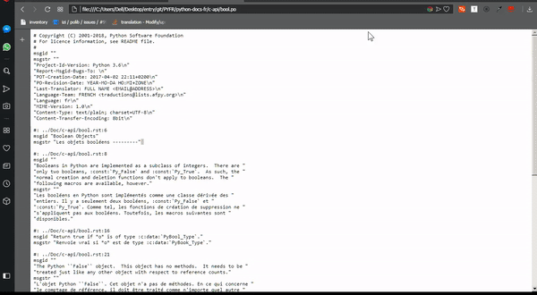

# aidre
🐍 📝 Python Translation Help Station - The software for 📄 .po file docs handling

# 🍄 Project Motivation
ignited with [this](assets/PTWSP-_.pdf) document. we launched several initiatives. aidre is one of them. a big 🔊 shoutout for the french translation team for support.

# 🍥 About
besides being a .po editor (yes, a python powered .po editor), it plans on integrating more tools to make translation participation a painless process. we aim at being 100% beginner friendly!

# 🍳 Demo

#


# 💥 Dependencies
* polib
* flask

# 🔮 Stability
- alpha

# 🔌 Quickstart
- pip install requirements.txt
- run main.py
- go to ```localhost:5000/```

# 📞 Contact
* [@Abdur-RahmaanJ](https://github.com/abdur-rahmaanj) | arj.python@gmail.com
- Julien Palard

# 👏 Credits
- Sergio Pedercini: Percentage Completion Chart
